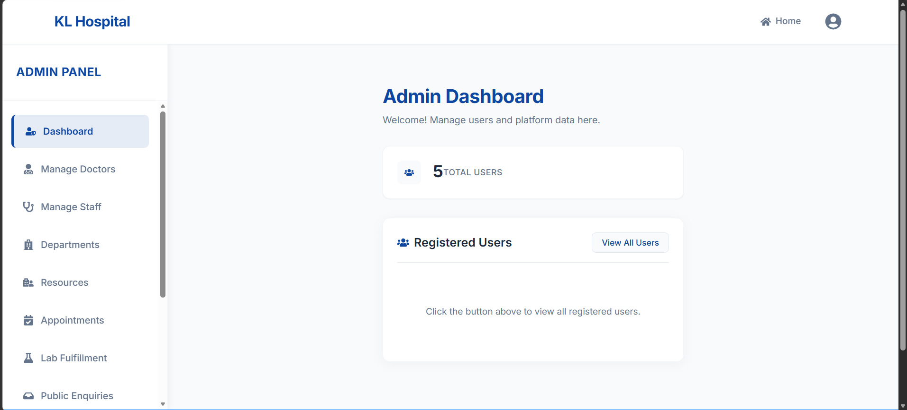
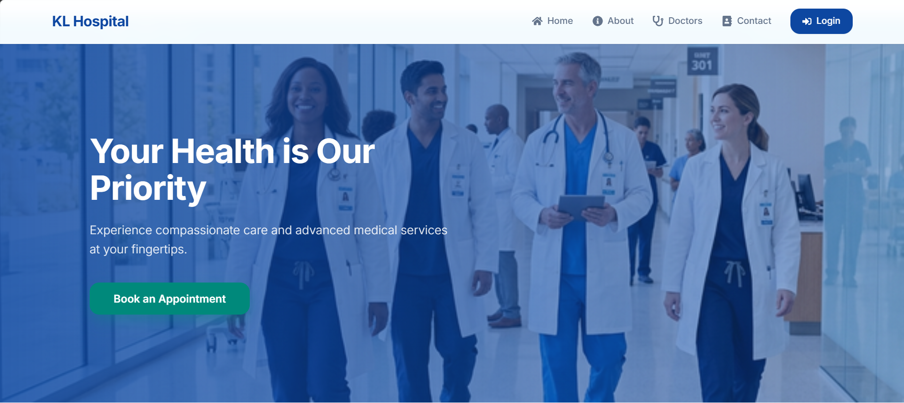
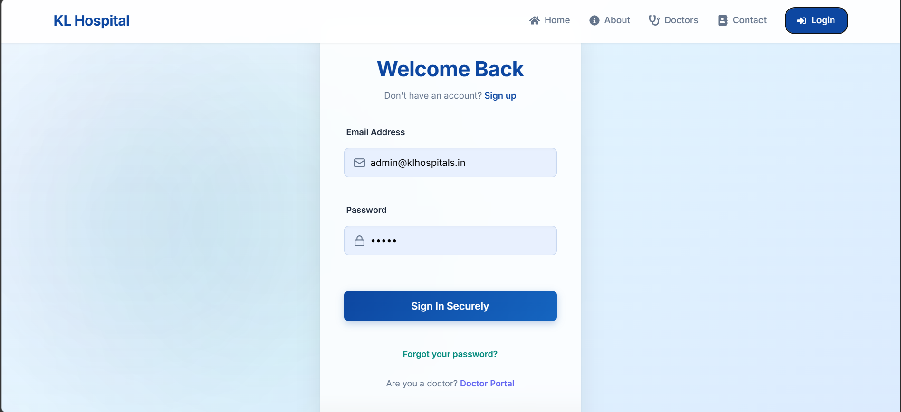
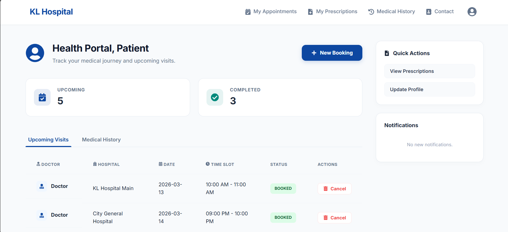
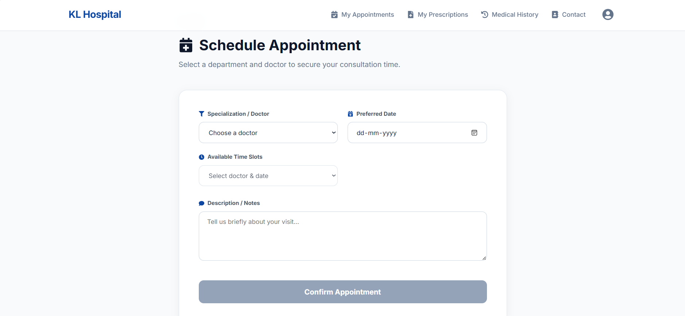
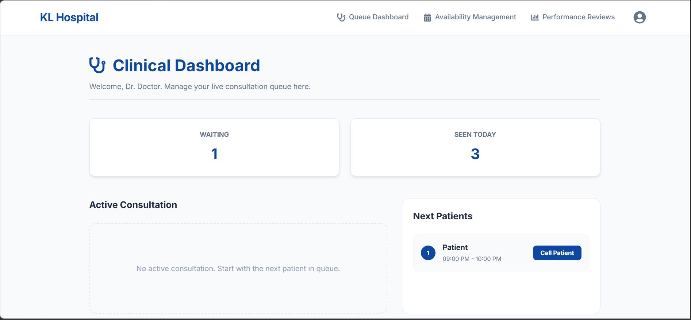
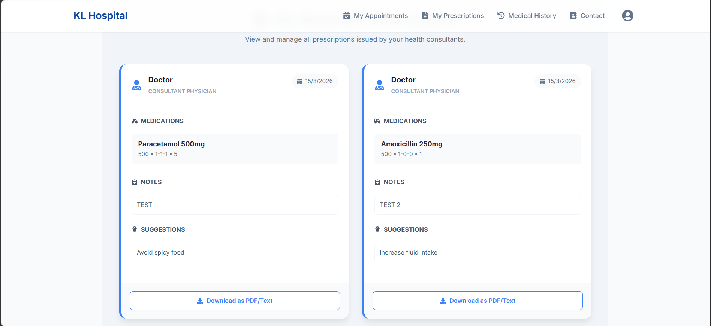

# KL Hospitals Management System (HMS)




KL Hospitals Management System (HMS) is a **full-stack enterprise-grade healthcare management platform** designed to streamline hospital operations, enhance patient care, and provide doctors with advanced clinical management tools.

It integrates **patient management, doctor workflows, and administrative control** into a unified digital healthcare ecosystem.

---

# Table of Contents

* Project Overview
* Key Features
* User Roles
* System Workflow
* System Architecture
* Security Architecture
* Technology Stack
* Project Structure
* Installation & Setup
* Environment Variables
* Usage
* API Endpoints
* Implementation Details
* Database Schema
* Security Best Practices
* Performance & Scalability
* UI Overview
* Screenshots
* Limitations
* Future Improvements
* Learning Outcomes
* Deployment
* Contributing
* License
* Author

---

# Project Overview

Modern healthcare systems require seamless coordination between **patients, clinicians, and administrators**. Traditional hospital workflows often rely on fragmented software or manual processes.

This project introduces a **centralized digital ecosystem** that improves operational efficiency while maintaining high security standards.

### Problem Solved

* Reduces patient wait times
* Prevents appointment scheduling conflicts
* Secures sensitive medical data
* Eliminates paper-based prescription errors
* Improves hospital workflow transparency

### Purpose

To create a **Single Source of Truth for medical records** while ensuring **high availability, scalability, and security**.

### Real-World Use Cases

* Multi-specialty hospitals
* Private clinics
* Government healthcare facilities
* Medical institutions managing large patient volumes

---

# Key Features

## Functional Features

* **Live Patient Queue**
  Doctors manage real-time patient queues.

* **Appointment Lifecycle Management**
  Booking, confirmation, consultation, and cancellation workflow.

* **Electronic Health Records (EHR)**
  Secure storage of patient medical history and prescriptions.

* **Smart Feedback Hub**
  Sentiment analysis and department performance metrics.

* **Personnel Management**
  Admin tools to manage hospital staff.

---

## Technical & Security Features

* **JWT-Based Authentication**
* **Role-Based Access Control (RBAC)**
* **IDOR Protection**
* **Automated Queue Notifications**
* **Responsive Glassmorphic UI**

---

# User Roles and Responsibilities

| Role    | Responsibilities                       | Data Access           | Restrictions                  |
| ------- | -------------------------------------- | --------------------- | ----------------------------- |
| Admin   | System configuration, staff management | Administrative data   | Cannot edit medical records   |
| Doctor  | Consultations and prescriptions        | Assigned patient data | Cannot modify system settings |
| Patient | Appointment booking and history        | Personal records      | Cannot access other users     |

---

# Role Interaction and System Workflow

## Appointment Booking Workflow

1. Patient searches doctor by specialization.
2. System validates available slots.
3. Patient selects slot and confirms booking.
4. Appointment appears in doctor dashboard.

## Consultation Workflow

1. Doctor calls patient.
2. Notification triggered.
3. Doctor opens consultation interface.
4. Prescription generated.
5. Medical record updated.
6. Patient submits feedback.

---

# System Architecture

```
Patient / Doctor / Admin
        |
        v
   React Frontend
        |
     REST APIs
        |
  Spring Boot Backend
        |
 Spring Security (JWT + RBAC)
        |
        v
     MySQL Database
```

### Frontend

React + Vite SPA using Context API and Axios.

### Backend

Spring Boot service layer implementing business logic.

### Database

MySQL relational database with indexed tables.

---

# Security Architecture

Security is implemented using **defense-in-depth principles**.

Layers:

1. Authentication Layer (JWT)
2. Authorization Layer (RBAC)
3. Data Access Validation (IDOR checks)
4. API Security Filters
5. Secure Database Queries (JPA)

---

# Technology Stack

### Frontend

* React 19
* Vite
* Axios
* React Router
* Lucide Icons
* CSS Modules

### Backend

* Java 17
* Spring Boot
* Spring Security
* Spring Data JPA
* Lombok

### Database

MySQL Server 8+

### DevOps

* Docker
* Docker Compose
* Nginx

---

# Project Structure

```
KL-HMS-PROJECT/

backend/
  config/
  controller/
  entity/
  repository/
  service/

frontend/
  components/
  context/
  pages/

docker-compose.yml
```

---

# Installation and Setup

## Prerequisites

* Java 17+
* Node.js 18+
* MySQL 8+

---

## Clone Repository

```
git clone https://github.com/your-repo/kl-hms.git
cd kl-hms
```

---

## Configure Database

Create database

```
hms_db
```

Update credentials in

```
application.properties
```

---

## Run Backend

```
cd backend
mvn spring-boot:run
```

---

## Run Frontend

```
cd frontend
npm install
npm run dev
```

---

# Environment Variables

Example backend environment configuration.

```
DB_URL=jdbc:mysql://localhost:3306/hms_db
DB_USERNAME=root
DB_PASSWORD=password
JWT_SECRET=your-secret-key
JWT_EXPIRATION=86400000
```

---

# Usage

## Admin

* Manage doctors
* Manage departments
* Monitor feedback analytics

## Doctor

* View patient queue
* Conduct consultations
* Issue prescriptions

## Patient

* Register account
* Book appointments
* View medical history

---

# API Endpoints (Sample)

| Method | Endpoint             | Description       |
| ------ | -------------------- | ----------------- |
| POST   | /api/auth/login      | Authenticate user |
| POST   | /api/appointments    | Book appointment  |
| GET    | /api/doctor/queue    | Doctor queue      |
| GET    | /api/patient/history | Medical history   |
| POST   | /api/feedback        | Submit feedback   |

---

# Implementation Details

### JWT Authentication

Uses `OncePerRequestFilter` to validate tokens.

### IDOR Protection

Ownership validation prevents unauthorized access.

```
user.getId().equals(requestedUserId)
```

### Conflict Resolution Algorithm

Booking service checks:

* Admin blocked dates
* Doctor blocked slots

Ensures **no double bookings**.

---

# Database Schema Overview

Main entities include:

* Users
* Patients
* Doctors
* Appointments
* Prescriptions
* Feedback

Relationships:

* One Doctor → Many Appointments
* One Patient → Many Medical Records
* One Appointment → One Prescription

---

# Security Best Practices

* JWT secure authentication
* RBAC authorization control
* IDOR protection
* Input validation
* Secure password hashing
* Stateless API sessions

---

# Performance & Scalability

System designed to scale with:

* Stateless backend APIs
* Database indexing
* Containerized deployment
* Horizontal scaling support

---

# UI Overview

### Clinical Dashboard

Real-time patient queue view.

### Health Portal

Patient-centered medical dashboard.

### Feedback Hub

Analytics dashboard for hospital performance.

---

# Screenshots

## Home Page
The modern and responsive landing page of the hospital management system.



## Login Page
Secure, role-based login portal for Admins, Doctors, and Patients.



## Patient Dashboard
Patients can manage appointments, medical history, and notifications.



## Appointment Booking
Real-time appointment scheduling with conflict prevention logic.



## Doctor Dashboard
Doctors can manage their patient queue, schedule, and consultations.



## Medical Records
Centralized electronic health records (EHR) and prescriptions management.



## Admin Dashboard
Complete administrative control over staff, resources, and finances.


## Analytics Dashboard
Visual breakdown of hospital performance, patient feedback, and system usage.


---

# Limitations

* No real-time chat system
* Payment gateway not integrated
* File uploads limited

---

# Future Improvements

* AI-assisted diagnosis
* Telemedicine (WebRTC)
* Smart appointment rescheduling
* Multilingual support
* Predictive healthcare analytics

---

# Learning Outcomes

* Implemented secure authentication with JWT
* Applied RBAC and IDOR protection
* Built scalable React + Spring Boot architecture
* Implemented containerized deployment with Docker

---

# Deployment

Example production architecture:

```
User
 |
Nginx Reverse Proxy
 |
React Frontend
 |
Spring Boot API
 |
MySQL Database
```

Deployment can be performed using:

* Docker containers
* Nginx reverse proxy
* Cloud hosting (AWS / Azure / GCP)

---

# Contributing

1. Fork repository
2. Create feature branch
3. Commit changes
4. Push branch
5. Open Pull Request

---

# License

Distributed under the **MIT License**.

---

# Author

Developed by **Macharla Sainadh**
